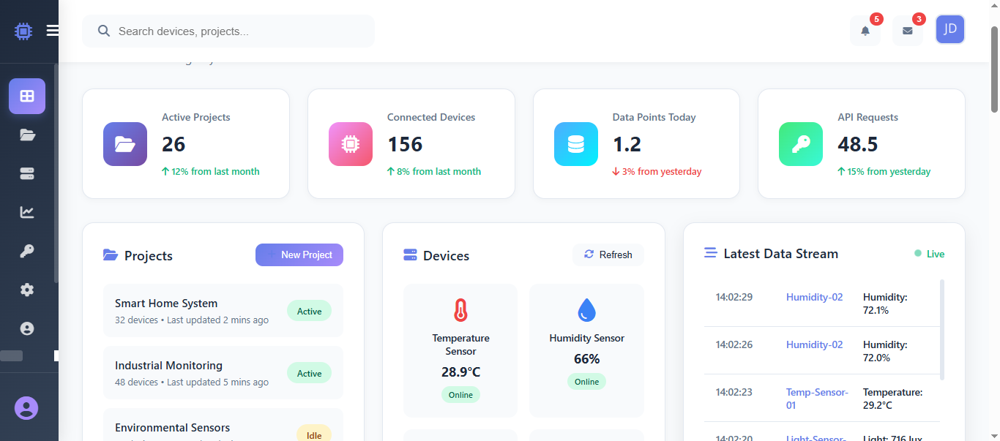

# OrionSense IOT HUB


## About
OrionSenseHub is an IoT server developed with Django as the main backend and uses DRF for API endpoints. Provides SaaS(AI) and other services eg analytics.

Supports:
- Websockets
- API calls
---


```bash
POST /api/projects/<project_id>/devices/<device_id>/data/
Authorization: Api-Key <project_api_key>
Content-Type: application/json

```
#### JSON Body Examples
```json
{
    "sensor_type":"Temperature",
    "value":25.7
}
```
```json
{
    "sensor_type":"Humidity",
    "value":25.7
}
```